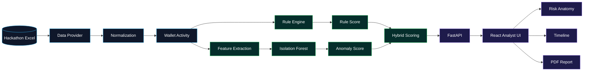
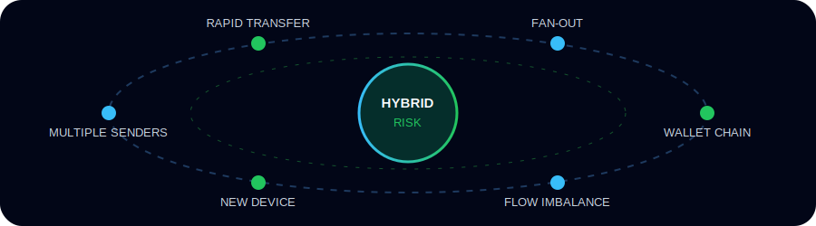
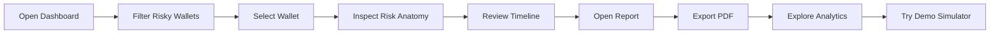

<div align="center">


[](https://git.io/typing-svg)

**MuleShield AI is an explainable fraud intelligence prototype that identifies potentially suspicious wallet behavior by combining deterministic transaction rules with unsupervised anomaly detection.**


> Built with the provided hackathon transaction dataset. MuleShield AI is a decision-support and investigation prototype—not a payment processor or live banking integration.

</div>

---

##  Problem

Money mule activity is difficult to identify by reviewing transactions in isolation. Suspicious behavior often emerges from combined patterns: funds arriving from many sources, leaving shortly afterward, spreading across many recipients, or moving repeatedly between wallets.

Manual review across a large wallet population is slow and makes prioritization difficult. Analysts need a way to rank wallets, understand why they were flagged, and inspect the supporting evidence.

##  Solution

MuleShield AI analyzes the hackathon transaction dataset at wallet level and produces:

- A deterministic rule-based risk score
- An unsupervised anomaly score
- A combined hybrid risk score
- Human-readable detection reasons
- A signal-by-signal Risk Anatomy breakdown
- Searchable monitoring, account, alert, analytics, and investigation views
- Wallet transaction timelines and client-side PDF reports
- A separate JSON-based transaction simulator

The system keeps each rule contribution in `risk_breakdown`, making its deterministic assessment traceable instead of presenting only a final score.

<div align="center">



<sub>Rule intelligence, anomaly detection, and explainable investigation in one analyst workspace.</sub>

</div>

##  How It Works

1. FastAPI loads `datasets/real/hackathon-data-trx.xlsx`.
2. Excel rows are normalized into incoming, outgoing, wallet-transfer, or unknown records.
3. Transactions are grouped into wallet-level activity.
4. Six deterministic rules produce an explainable rule score.
5. Wallet metrics are transformed with `log1p` and evaluated by Isolation Forest.
6. Rule and anomaly results are combined into a hybrid score.
7. Results are cached in memory during backend startup.
8. The React frontend retrieves the hybrid dashboard and wallet details from the `/dataset` API.
9. Analysts can filter wallets, inspect Risk Anatomy, review timelines, and export an investigation PDF.

> The simulator uses the separate JSON files under `datasets/demo`. It does not modify the Excel hackathon dataset.

##  System Architecture



<details>
<summary><strong>Core backend components</strong></summary>

- `excel_data_provider.py` reads and normalizes the hackathon Excel file.
- `risk_engine.py` calculates wallet metrics and deterministic risk contributions.
- `ml_anomaly_detector.py` runs Isolation Forest and hybrid scoring.
- `analysis_cache.py` caches transactions and wallet analysis results.
- FastAPI routes expose dataset, risk, transaction, explanation, and simulator operations.

</details>

##  Risk Signals

<div align="center">



</div>

The rule score is the sum of six signal contributions, capped at `100`.

| Signal | Backend condition | Maximum |
|---|---|---:|
| **Multiple Senders** | Unique incoming sources | 25 |
| **Rapid Transfer** | Amount-matched outgoing transfers within 60 minutes | 30 |
| **Fan-Out** | Unique outgoing targets | 25 |
| **Wallet Chain** | Incoming and outgoing wallet-to-wallet transfers | 15 |
| **Flow Imbalance** | Outgoing/incoming volume ratio with at least 3 outgoing transactions | 10 |
| **New Device** | Device identifier equals `NEW_DEVICE` | 20 |

<details>
<summary><strong>View exact rule thresholds</strong></summary>

### Multiple Senders

| Unique senders | Score |
|---:|---:|
| 0–4 | 0 |
| 5–9 | 5 |
| 10–24 | 10 |
| 25–49 | 20 |
| 50+ | 25 |

### Rapid Transfer

An outgoing transaction is counted when eligible incoming funds from the preceding 60 minutes cover at least 50% of its amount. Matched incoming amounts are consumed to prevent repeated matching.

| Matched transfers | Score |
|---:|---:|
| 0 | 0 |
| 1–2 | 10 |
| 3–9 | 20 |
| 10–19 | 25 |
| 20+ | 30 |

### Fan-Out

| Unique targets | Score |
|---:|---:|
| 0–9 | 0 |
| 10–24 | 5 |
| 25–99 | 10 |
| 100–499 | 20 |
| 500+ | 25 |

### Wallet Chain

| Wallet transfers | Score |
|---:|---:|
| 0–2 | 0 |
| 3–9 | 5 |
| 10–19 | 10 |
| 20+ | 15 |

### Flow Imbalance

Applied only when incoming volume is positive and at least three outgoing transactions exist.

| Outgoing / incoming ratio | Score |
|---:|---:|
| Below 1.2 | 0 |
| 1.2–1.99 | 3 |
| 2.0–4.99 | 5 |
| 5.0–9.99 | 8 |
| 10.0+ | 10 |

### New Device

Adds `20` points when wallet activity contains the device identifier `NEW_DEVICE`.

</details>

### Rule risk levels

| Rule score | Level |
|---:|---|
| 0–29 | Safe |
| 30–59 | Suspicious |
| 60–100 | Critical |

##  Hybrid Risk Approach

### Rule engine

The deterministic layer returns `risk_score`, `risk_level`, `risk_breakdown`, human-readable `reasons`, and supporting wallet metrics. During hybrid enrichment, this score is retained as `rule_risk_score`.

### ML / anomaly layer

The backend uses scikit-learn's `IsolationForest` with:

```text
n_estimators = 300
contamination = 0.02 (default)
random_state = 42
n_jobs = -1
```

Its wallet-level features are transaction counts, unique senders and targets, rapid transfers, wallet transfers, incoming and outgoing totals, and outgoing ratio. Values are transformed using `log1p`.

The exposed `ml_anomaly_score` is a percentile-based relative anomaly score from 0 to 100—not a fraud probability. With fewer than ten wallets, the ML layer returns zero anomaly scores instead of fitting the model.

### Hybrid calculation

```text
If Isolation Forest marks the wallet as anomalous:
hybrid = rule_score × 0.60 + ml_anomaly_score × 0.40

Otherwise:
hybrid = rule_score × 0.60 + (ml_anomaly_score × 0.25) × 0.40
```

The result is rounded and capped at `100`.

| Hybrid score | Level |
|---:|---|
| 0–19 | Safe |
| 20–34 | Watchlist |
| 35–59 | Suspicious |
| 60–100 | Critical |

### Explainable Risk Anatomy

Risk Anatomy visualizes the deterministic contribution of Multiple Senders, Rapid Transfer, Fan-Out, Wallet Chain, Flow Imbalance, and New Device. The UI can therefore present a combined prioritization score alongside the observable behaviors supporting it.

##  Key Features

| Area | Verified capability |
|---|---|
| **Dashboard** | Dataset totals, risk distribution, wallet filtering, search, pagination, and risk indicators |
| **Accounts** | Search, risk filtering, wallet metrics, pagination, and Risk Anatomy |
| **Alerts** | Risk-oriented wallet queue, search, filters, signal inspection, and report navigation |
| **Investigation Reports** | Score summaries, reasons, metrics, signals, evidence, and recommended analyst actions |
| **Transaction Timeline** | Direction, source, target, amount, timestamp, and pagination |
| **PDF Export** | Browser-generated investigation report through jsPDF and jspdf-autotable |
| **Simulator** | Adds a transaction to demo JSON data and restores the default demo dataset |
| **Analytics** | Risk distribution, anomaly counts, signal activity, money flow, and Recharts visualizations |

##  Technology Stack

| Layer | Technologies |
|---|---|
| Frontend | React 19, Vite 8, Axios, Recharts, Lucide React, CSS |
| PDF | jsPDF, jspdf-autotable |
| Backend | Python, FastAPI, Uvicorn, Pydantic |
| Data & ML | pandas, NumPy, scikit-learn, openpyxl |
| Storage | Hackathon Excel dataset, demo JSON files, in-memory analysis cache |
| Quality | Oxlint, Vite production build |

##  Installation and Running

### Prerequisites

- Python with `venv` and `pip`
- Node.js and npm

### Backend

macOS/Linux:

```bash
cd backend
python3 -m venv venv
source venv/bin/activate
pip install -r requirements.txt
uvicorn main:app --reload
```

Windows:

```bat
cd backend
python -m venv venv
venv\Scripts\activate
pip install -r requirements.txt
uvicorn main:app --reload
```

Backend: `http://127.0.0.1:8000`<br>
Swagger UI: `http://127.0.0.1:8000/docs`

The backend expects the hackathon dataset at `datasets/real/hackathon-data-trx.xlsx`.

### Frontend

In a second terminal:

```bash
cd frontend
npm install
npm run dev
```

Frontend: `http://localhost:5173`

The frontend currently sends API requests to `http://127.0.0.1:8000`.

### Convenience scripts

```bash
# macOS
chmod +x start-mac.sh
./start-mac.sh
```

```bat
:: Windows
start-windows.bat
```

The macOS script uses macOS Terminal automation and the `open` command.

### Quality checks

```bash
cd frontend
npm run lint
npm run build
```

##  API Endpoints

### Service and hackathon dataset

| Method | Endpoint | Description |
|---|---|---|
| GET | `/` | Service status message |
| GET | `/health` | Basic health response |
| GET | `/dataset/summary` | Dataset, direction, wallet, IBAN, and amount summary |
| GET | `/dataset/transactions` | Paginated normalized hackathon transactions |
| GET | `/dataset/risk-accounts` | Wallets filtered by minimum rule score |
| GET | `/dataset/risk-distribution` | Rule-score distribution and percentile statistics |
| GET | `/dataset/ml-anomalies` | Isolation Forest anomaly results |
| GET | `/dataset/hybrid-risk` | Rule, anomaly, and hybrid wallet results |
| GET | `/dataset/dashboard` | Hybrid summary and frontend wallet list |
| GET | `/dataset/wallet/{wallet_id}` | Hybrid details for one wallet |
| GET | `/dataset/wallet/{wallet_id}/transactions` | Transactions involving one wallet |

### Demo JSON and simulator

| Method | Endpoint | Description |
|---|---|---|
| GET | `/accounts` | Demo accounts with rule risk levels |
| GET | `/dashboard` | Summary calculated from demo JSON data |
| GET | `/risk/{account_id}` | Rule risk details for a demo account |
| GET | `/explain/{account_id}` | Text explanation for a demo account |
| GET | `/transactions/{account_id}` | Demo transactions involving an account |
| POST | `/transactions` | Adds a transaction to the demo JSON dataset |
| POST | `/simulation/reset` | Restores the default demo transactions |

##  Demo Flow



1. Open the Dashboard and introduce the hackathon dataset summary.
2. Filter or search the wallet list and select a prioritized wallet.
3. Explain the combined score through Risk Anatomy.
4. Review the wallet's metrics, reasons, and supporting transactions.
5. Open Alerts to demonstrate analyst prioritization.
6. Open Reports and inspect the transaction timeline.
7. Export the selected investigation as a PDF.
8. Use Analytics to review anomaly counts, signal prevalence, and money flow.
9. Use Simulator to add or reset a transaction in the separate demo JSON dataset.

##  Repository Structure

```text
muleshield-ai/
├── ai-engine/                 # Earlier standalone rule-engine script
├── backend/
│   ├── main.py                # FastAPI application
│   ├── routes/                # Dataset, risk, transaction and simulator APIs
│   └── services/              # Data providers, cache, rules and ML
├── datasets/
│   ├── demo/                  # Mutable JSON simulator data
│   └── real/                  # Hackathon Excel transaction dataset
├── docs/                      # Project documentation
├── frontend/
│   ├── public/
│   └── src/
│       ├── components/        # Reusable interface components
│       ├── pages/             # Dashboard, accounts, alerts and reports
│       ├── styles/            # Page and component styles
│       └── utils/             # PDF generation
├── requirements.txt
├── start-mac.sh
└── start-windows.bat
```

### Documentation Index

| Document | Focus |
|---|---|
| [Problem Definition](docs/problem.md) | Threat context, analyst needs, scope, and responsible interpretation |
| [System Architecture](docs/architecture.md) | Data flow, scoring pipeline, cache, frontend state, and trust boundaries |
| [Hackathon Demo Scenario](docs/demo-scenario.md) | Presentation script, timing, jury questions, and recovery checklist |
| [Product and Engineering Roadmap](docs/roadmap.md) | Clearly separated future phases and validation requirements |

##  Current Limitations

- This is a hackathon prototype, not a production fraud decision system.
- The primary input is a local Excel file rather than a live transaction stream.
- No bank API, payment-network integration, database, authentication, or role management is implemented.
- Demo transactions are persisted to local JSON files.
- CORS currently allows all origins, and the frontend API URL is hardcoded.
- Analysis is cached inside the backend process rather than a persistent cache.
- Isolation Forest is fitted on the loaded wallet population without labeled fraud outcomes.
- Anomaly percentiles are relative scores and must not be read as fraud probabilities.
- Rule thresholds are prototype settings that require domain and labeled-data validation.
- Simulator changes do not update the Excel-backed hybrid dashboard.
- PDF generation is client-side and reports are not stored or audited by the backend.
- The repository currently has no automated frontend or backend test suite.

##  Future Development

- Validate thresholds and weights using labeled outcomes and domain review
- Add model evaluation, drift monitoring, and model versioning
- Add persistent database storage and controlled cache invalidation
- Introduce authentication and role-based analyst access
- Move API and CORS configuration to environment variables
- Add automated backend and frontend tests
- Add analyst feedback, case state, and audit logging
- Add controlled external transaction ingestion
- Explore graph-based wallet relationship analysis
- Improve deployment packaging and operational monitoring

> These are roadmap items and are not part of the current implementation.

##  Team and Contributions

### Hamza Çiftçi

- Backend development
- Risk engine
- System architecture

### Çağıl Emek Kurtul

- Frontend development
- UI/UX design
- Documentation
- Project management

<details>
<summary><strong>AI-assisted development disclosure</strong></summary>

AI tools were used to support architecture brainstorming, UI/UX refinement, code organization, documentation drafting, and demo dataset preparation. Implementation decisions, integration, and final validation remain the responsibility of the project team.

</details>

---

<div align="center">

**Explain the signal. Prioritize the wallet. Support the investigation.**


</div>
