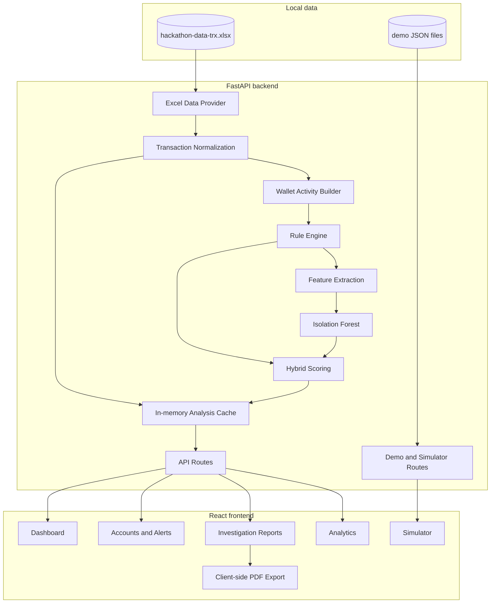

# System Architecture

[← Back to README](../README.md)

## Overview

MuleShield AI is a local two-tier application:

- A React frontend provides analyst-facing monitoring and investigation views.
- A FastAPI backend loads local datasets, normalizes transactions, calculates wallet risk, caches results, and exposes JSON endpoints.

The main dashboard uses the supplied Excel hackathon dataset. The simulator uses a separate JSON demo dataset.



## Data Sources

### Hackathon dataset

Path: `datasets/real/hackathon-data-trx.xlsx`

`backend/services/excel_data_provider.py` validates the required columns and maps supported transaction types:

| Process type | Direction | Source | Target |
|---|---|---|---|
| `2-1`, `2-42` | Outgoing | Wallet | IBAN |
| `1-4`, `1-70` | Incoming | IBAN | Wallet |
| `2-2` | Wallet transfer | Wallet | Wallet |

Other types remain normalized with direction `unknown`. Each normalized row receives an `HTX` transaction identifier and ISO-formatted timestamp when the date is parseable.

### Demo dataset

The legacy/demo routes use:

- `datasets/demo/sample_users.json`
- `datasets/demo/sample_transactions.json`
- `datasets/demo/default_transactions.json`

`POST /transactions` writes to `sample_transactions.json`. `POST /simulation/reset` copies the default transaction file over it.

## Backend Processing Pipeline

### 1. Startup cache

The FastAPI lifespan handler calls `warm_analysis_cache()`. The cache loads normalized Excel transactions, calculates all rule results, enriches them with ML and hybrid fields, and builds a wallet lookup map.

Caching uses Python `lru_cache`; it is process-local and non-persistent.

### 2. Wallet activity aggregation

`build_wallet_activity()` groups normalized records into:

- Incoming transactions
- Outgoing transactions
- Incoming wallet transfers
- Outgoing wallet transfers
- Unique incoming senders
- Unique outgoing targets
- Observed device identifiers
- Total incoming and outgoing amounts

### 3. Rule engine

The rule layer calculates:

- Multiple Senders: maximum 25
- Rapid Transfer: maximum 30
- Fan-Out: maximum 25
- Wallet Chain: maximum 15
- Flow Imbalance: maximum 10
- New Device: 20 when `NEW_DEVICE` is present

The sum is capped at 100. Rule levels are Safe below 30, Suspicious from 30 to 59, and Critical from 60.

Rapid Transfer matches outgoing events against incoming value from the preceding 60 minutes. At least half of the outgoing amount must be covered by eligible incoming value, and matched value is consumed.

### 4. ML anomaly layer

`backend/services/ml_anomaly_detector.py` uses scikit-learn `IsolationForest` with 300 estimators, default contamination `0.02`, random state `42`, and all available CPU jobs.

The feature vector contains nine wallet metrics:

1. Incoming transaction count
2. Outgoing transaction count
3. Unique sender count
4. Unique target count
5. Rapid transfer count
6. Wallet-transfer count
7. Total incoming amount
8. Total outgoing amount
9. Outgoing ratio

Values are sanitized, constrained to non-negative finite numbers, and transformed with `log1p`. The exposed anomaly score is the percentile rank of the inverted Isolation Forest sample score. It is not a probability.

For fewer than ten wallets, the layer returns zero anomaly scores without fitting a model.

### 5. Hybrid layer

For an ML-classified anomaly:

```text
hybrid = rule × 0.60 + anomaly percentile × 0.40
```

For other wallets:

```text
hybrid = rule × 0.60 + (anomaly percentile × 0.25) × 0.40
```

The rounded score is capped at 100. Hybrid levels are Safe below 20, Watchlist from 20 to 34, Suspicious from 35 to 59, and Critical from 60.

The dataset API maps hybrid score and level into the frontend-facing `risk_score` and `risk_level`, while retaining rule, hybrid, and ML fields.

## Frontend State and Request Flow

`frontend/src/App.jsx` loads `GET /dataset/dashboard` when the application starts. Selecting a wallet triggers two requests in parallel:

```text
GET /dataset/wallet/{wallet_id}
GET /dataset/wallet/{wallet_id}/transactions
```

The selected wallet, risk detail, explanation, and normalized transaction list are kept in React state and passed to the relevant pages.

The frontend includes Dashboard, Accounts, Alerts, Reports, Analytics, Simulator, and Contact views. Navigation is state-based rather than URL-router based.

## PDF Generation

`frontend/src/utils/generateInvestigationPDF.js` generates reports in the browser with jsPDF and jspdf-autotable. The PDF is not generated, stored, or audited by the backend.

## API Boundary

The frontend currently calls `http://127.0.0.1:8000`. FastAPI permits all CORS origins. Both settings are appropriate for local demonstration but should become environment-specific before deployment.

## Failure and Fallback Behavior

- Missing or invalid Excel input produces backend errors through the dataset routes.
- An unknown wallet returns HTTP 404.
- Invalid `limit`, `offset`, or `contamination` values return HTTP 400 where validated.
- Frontend request failures produce a toast and preserve the application shell.
- Missing wallet fields are adapted to frontend defaults in `adaptWalletForFrontend()`.

## Trust Boundaries and Limitations

- All data is local and trusted by the prototype; there is no authentication boundary.
- JSON simulator writes are not synchronized with the Excel analysis cache.
- Cached analysis is not shared between backend processes.
- The ML model is fitted to the loaded population without labeled outcomes.
- No automated enforcement follows a risk result.
